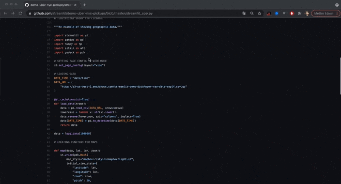

# `stgh` Chrome Extension

This Chrome Extension enables you to quickly open the relevant GitHub code of a Streamlit app in a new tab.  
Or vice versa, you can also just open the Streamlit app from the GitHub code!

## How to install

1. Clone the repo `git clone https://github.com/arnaudmiribel/stgh`
2. In Chrome, visit `chrome://extensions`
3. On the top right, make sure you have enabled Developer mode
4. Click on `Load unpacked` and point to the directory of `ghst-extension`
5. You should see the newly installed Chrome Extension in your bar. Make sure to pin it if you want to always have it on your side.

## TODO

- [ ] On GitHub, modify DOM to also add a button `Open in Streamlit` 
- [ ] Make a better logo...
- [ ] Support when URL ends with parameters e.g. `?page=headliner`

